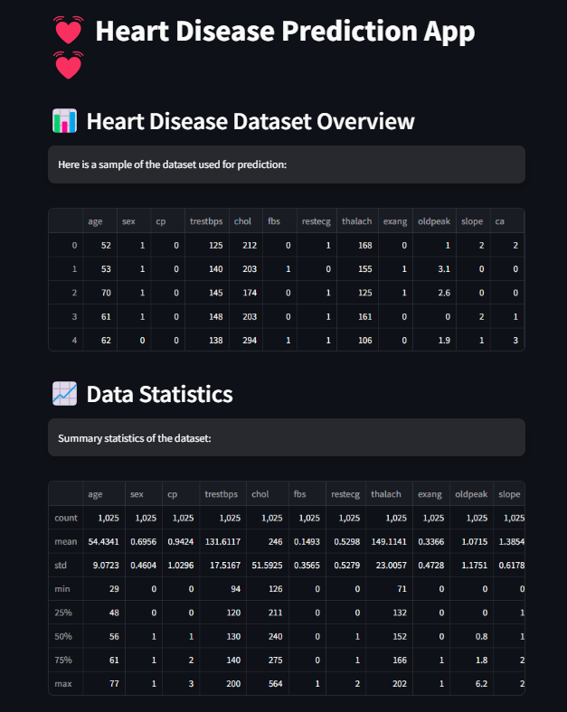
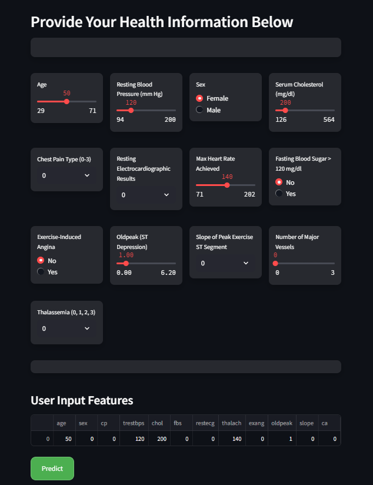
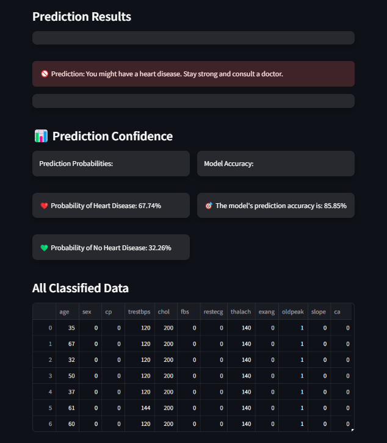
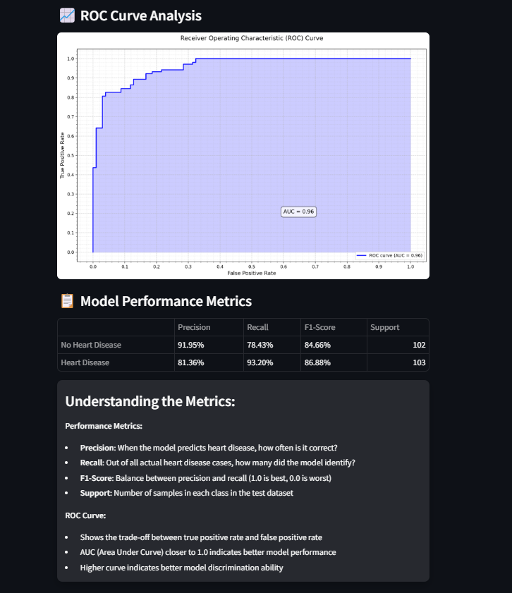

# Heart Disease Prediction Web Application

## Introduction

This Streamlit-based web application predicts the likelihood of heart disease based on user-provided health information. It utilizes a Random Forest Classifier model trained on the Heart Disease Dataset.

## Features

- **User Input**: Users can input their health information through a user-friendly interface.
- **Prediction**: The app predicts whether the user is at risk of heart disease and provides the probability of the prediction.
- **Model Evaluation**: Displays model performance metrics, including accuracy, precision, recall, and F1-score.
- **Learning Curves**: Visualizes the model's learning curves to show how performance improves with more training data.
- **ROC Curve**: Displays the Receiver Operating Characteristic (ROC) curve to evaluate the model's discrimination ability.
- **Data Storage**: Saves user inputs and predictions for future reference.

## Snapshots

### 1. ROC Curve Analysis
- Displays the Receiver Operating Characteristic (ROC) curve.
- AUC (Area Under Curve) is 0.96, indicating excellent model performance.


### 2. Model Learning Curves
- Visualizes how the model's performance improves with more training data.
- Shows training and validation accuracy and error rates.


### 3. Prediction Results
- Displays the prediction result and model accuracy.


### 4. User Input Interface
- Users can input their health information.


### 5. Heart Disease Dataset Overview
- Provides a sample of the dataset and summary statistics.


## How to Run

To run the application, follow these steps:

1. **Clone the Repository**:
   ```bash
   git clone https://github.com/your-username/heart-disease-prediction-app.git
   cd heart-disease-prediction-app
   ```

2. **Install Dependencies**:
   ```bash
   pip install -r requirements.txt
   ```
   The `requirements.txt` file should include:
   ```
   streamlit==1.0.0
   pandas==1.3.3
   numpy==1.21.2
   scikit-learn==1.0.2
   joblib==1.1.0
   matplotlib==3.4.3
   ```

3. **Run the Application**:
   ```bash
   streamlit run app2.py
   ```

4. **Access the Application**:
   Open your web browser and go to `http://localhost:8501` to use the application.
