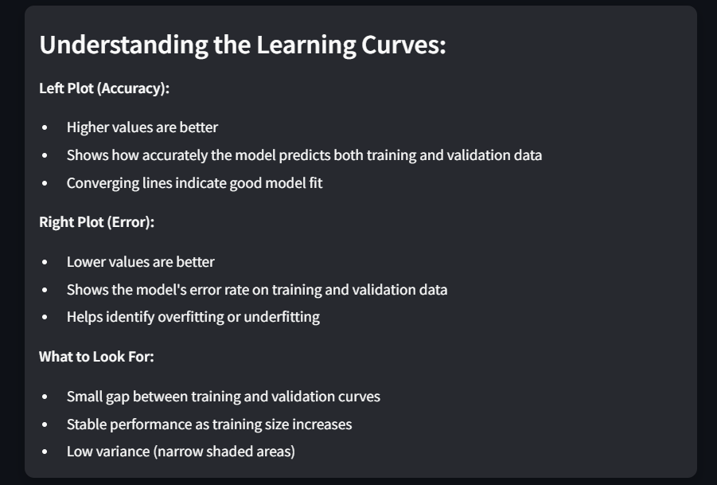

# Heart Disease Prediction Web Application


## Introduction

This Streamlit-based web application predicts the likelihood of heart disease based on user-provided health information. It utilizes a Random Forest Classifier model trained on the Heart Disease Dataset.

## Features

- **User Input**: Users can input their health information through a user-friendly interface.
- **Prediction**: The app predicts whether the user is at risk of heart disease and provides the probability of the prediction.
- **Model Evaluation**: Displays model performance metrics, including accuracy, precision, recall, and F1-score.
- **Learning Curves**: Visualizes the model's learning curves to show how performance improves with more training data.
- **ROC Curve**: Displays the Receiver Operating Characteristic (ROC) curve to evaluate the model's discrimination ability.
- **Data Storage**: Saves user inputs and predictions for future reference.

## Snapshots and Detailed Descriptions

### 1. Dataset Overview and Data Statistics
- **Overview**: Provides a sample of the dataset used for training the model.
- **Statistics**: Displays summary statistics including mean, standard deviation, min, max, and percentiles for each feature.


### 2. User Input Interface
- **Interface**: Users can input their health information using sliders, radio buttons, and dropdown menus.
- **Features**: Includes age, sex, cholesterol levels, blood pressure, and other relevant health metrics.


### 3. Prediction Result and All Classified Data
- **Prediction Result**: Shows whether the user might have heart disease along with the prediction probabilities.
- **All Classified Data**: Displays a table of all user inputs and their corresponding predictions.


### 4. Model Learning Curves
- **Learning Curves**: Visualizes how the model's performance improves with more training data.
- **Details**:
  - Blue lines represent training performance.
  - Orange lines represent validation performance.
  - Shaded areas represent performance variance.
    



### 5. ROC Curve Analysis
- **ROC Curve**: Displays the Receiver Operating Characteristic curve to evaluate the model's discrimination ability.
- **Metrics**:
  - AUC (Area Under Curve): 0.96
  - Precision, Recall, and F1-Score for both classes (No Heart Disease and Heart Disease).


## How to Run

To run the application, follow these steps:

1. **Clone the Repository**:
   ```bash
   git clone https://github.com/your-username/heart-disease-prediction-app.git
   cd heart-disease-prediction-app
   ```

2. **Install Dependencies**:
   Install the necessary Python packages by running the following command:
   ```bash
   pip install -r requirements.txt
   ```
   The `requirements.txt` file should include the following packages:
   ```
   streamlit==1.0.0
   pandas==1.3.3
   numpy==1.21.2
   scikit-learn==1.0.2
   joblib==1.1.0
   matplotlib==3.4.3
   ```

3. **Run the Application**:
   Start the Streamlit application by running:
   ```bash
   streamlit run app2.py
   ```

4. **Access the Application**:
   Open your web browser and go to `http://localhost:8501` to use the application.

